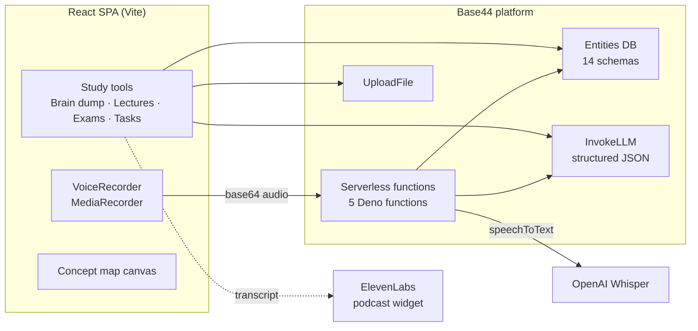

<div align="center">

# 🧠 divrgnt.io

**A learning platform built for people with ADHD.**


</div>

---

Long lectures, messy notes, and "where do I even start?" are where ADHD students lose the most time. divrgnt breaks lectures into interactive study modules, turns spoken brain dumps into structured notes, and builds exam study plans around how much time is actually left.

## 📑 Table of Contents

- [Architecture](#️-architecture)
- [Design Decisions](#-design-decisions)
- [Challenges](#-challenges)
- [Features](#-features)
- [Tech Stack](#-tech-stack)
- [Project Structure](#-project-structure)
- [Getting Started](#-getting-started)
- [Known Limitations](#️-known-limitations)

## 🏗️ Architecture



- **Frontend:** a React 18 single-page app. The main flows are Brain Dump, Lecture Upload → Processing → Results, Exam Prep, Tasks, Classes, and Concept Maps. There's also an infinite canvas for visual thinking.
- **Data model:** 14 entities in `base44/entities/`:
  - **Capture:** `BrainDump`, `ProcessedVideo`
  - **Courses:** `Class`, `Exam`, `ExamMaterial`
  - **Study content:** `StudyNotesSection`, `StudyFlashcard`, `StudyQuestion`, `ConceptMap`, `StudyBurst`
  - **Planning:** `Task`, `TaskPhase`, `TaskStep`
  - **Motivation:** `UserProgress`
- **Backend functions:** 5 Deno functions. `speechToText` proxies audio to Whisper. `parseSyllabus` extracts course structure. `getNextTaskSuggestion` picks what to do next. `getUserProgress` and `updateUserProgress` handle scoring.
- **AI layer:** almost every feature is an `InvokeLLM` call with a `response_json_schema`, so AI output comes back as typed data (notes sections, flashcards, questions, tasks) that the UI can render and store directly.

## 🧠 Design Decisions

- **One next action, not a to-do list:** `getNextTaskSuggestion` scores every open task on deadline urgency and progress, then asks the LLM to recommend exactly one concrete step and explain why. It's built to cut decision fatigue, the "which thing first?" paralysis that's common with ADHD.
- **Big goals become phases, then steps:** tasks are broken into ordered phases and small steps, so there's always a next move that feels doable.
- **Talk first, organize later:** speaking a brain dump has less friction than writing one. Audio is recorded in the browser and transcribed by Whisper. It's then restructured into Cornell notes with exam questions, extracted concepts, action items, and links to existing study material.
- **API keys stay server-side:** the Whisper call runs in a serverless function, and the OpenAI key is read from environment secrets, so it never reaches the browser.
- **Many ways into the same material:** one lecture can become mechanistic analogies, flashcards, dynamic Q&A, real-world applications, a creative project, or a podcast. Students pick the mode that holds their attention.
- **Active recall over re-reading:** concept maps start with 5–7 AI-extracted keywords that the student connects themselves. The AI then gives feedback on the student's own summary, instead of handing them a finished map.
- **Diagrams only when they help:** the note-generation prompt allows flowcharts and diagrams only under strict conditions, to avoid visual clutter.
- **Motivation through progress:** the "Academic Weapon" score gives points for steps, phases, finished tasks and brain dumps, with streaks and levels from *Butter Knife* up to *Reality Bender*.

## 🐛 Challenges

### 1. Getting voice recordings to Whisper through a serverless function
The browser records `webm` audio with `MediaRecorder`, but serverless functions take JSON. Audio is base64-encoded on the client, decoded back to bytes in the Deno function, then rebuilt as multipart form data for Whisper. I added validation for invalid base64, missing MIME types, and empty transcriptions (with a "speak closer to the mic" hint), plus timestamped logging at every stage to trace failures.

### 2. Keeping AI-generated notes readable
Early LLM notes over-used diagrams and formatting, which is the opposite of what an ADHD reader needs. The note-generation prompt became a staged pipeline with explicit rules for when visuals are allowed, and every output is schema-constrained so the UI controls the layout.

### 3. Build errors after moving off the builder
After syncing the project to GitHub and building it locally, some page components failed to build because of how they were named. Renaming them fixed the build.

## ✨ Features

- **🎙️ Brain dump:** type or talk; get Cornell notes, key concepts, action items, and links to your existing materials
- **🎬 Lecture processing:** upload a lecture and get structured, sectioned notes with diagrams where they help
- **🧩 Learning modes:** analogical analysis, flashcard generator, dynamic Q&A, application generator, creation lab, and a social-media-style project creator
- **🎧 Podcast mode:** turn a transcript into a conversational audio session through an ElevenLabs voice agent
- **🗺️ Concept maps:** build maps from AI-suggested keywords and get feedback on your own summary
- **📅 Exam prep:** upload materials, set the exam date and session length, and get notes plus a study schedule scaled to the days left
- **📝 Practice:** flashcard review, practice questions, full practice exams, an AI tutor, and a Pomodoro timer
- **✅ Task breakdown:** turn assignments into phases and steps, and get a single "do this next" suggestion
- **🏫 Classes and calendar:** syllabus parsing, a smart calendar, and time-block scheduling
- **🏆 Academic Weapon score:** points, streaks, and levels for staying consistent

## 🧰 Tech Stack

| Layer | Technologies |
|---|---|
| **Frontend** | React 18, Vite, React Router |
| **Styling / UI** | Tailwind CSS, Radix UI, shadcn/ui, Framer Motion, Lucide icons |
| **Data & State** | TanStack Query, React Hook Form, Zod |
| **Visuals** | Mermaid (diagrams), Recharts, custom infinite canvas, math rendering |
| **Backend / Platform** | Base44 (auth, database, hosting, serverless functions) |
| **AI & Audio** | Base44 InvokeLLM (structured JSON), OpenAI Whisper, ElevenLabs Conversational AI |

## 📁 Project Structure

```
divergnt-io/
├── base44/
│   ├── entities/        # Data models
│   ├── functions/       # speechToText, parseSyllabus, task suggestions, progress
│   └── config.jsonc
├── src/
│   ├── components/
│   │   ├── brain-dump/  # Note structuring
│   │   ├── learning/    # Learning modes and tools
│   │   ├── exam/        # AI tutor, Pomodoro
│   │   ├── study/       # Flashcards, practice questions and exams
│   │   ├── integration/ # Knowledge graph, study path recommender
│   │   ├── tasks/       # Task breakdown and next-step suggestions
│   │   ├── calendar/    # Smart calendar, time blocking
│   │   └── ui/          # shadcn/ui primitives
│   ├── pages/
│   └── main.jsx
├── package.json
└── vite.config.js
```

## 🚀 Getting Started

### Prerequisites
- Node.js 18+ and npm
- [Deno](https://docs.deno.com/runtime/getting_started/installation/), which the local Base44 backend runs on
- Base44 CLI: `npm install -g base44@latest`
- An `OPENAI_API_KEY` secret set in your Base44 app (for voice transcription)

### Run locally

```bash
git clone https://github.com/richsudaniman/divergnt-io.git
cd divergnt-io
npm install
base44 login   # once per machine
base44 link    # once per clone
base44 dev     # runs the local backend and frontend together
```

> Use `base44 dev` rather than `npm run dev`. On its own, Vite serves the UI with no backend behind it.

## ⚠️ Known Limitations

- **Video transcription is simulated.** Uploaded lecture videos aren't transcribed from their audio yet; the LLM generates a representative transcript from the video's title. Uploaded documents and voice recordings are processed for real. Real video transcription (for example, extracting the audio and sending it through the existing Whisper function) is the next step.

## 📬 Contact

Built by **Jalal Abdelrahim** · [GitHub](https://github.com/richsudaniman)
